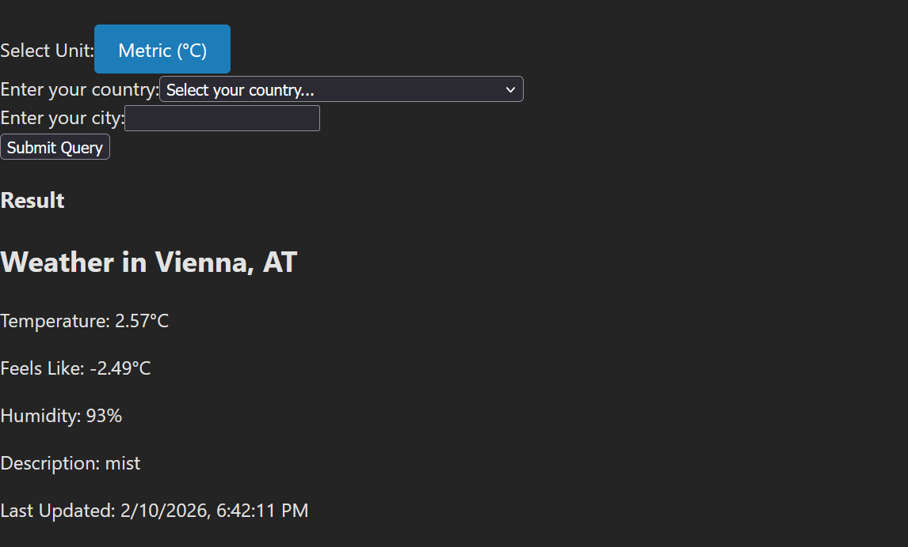

# Overview
A full-stack weather analytics dashboard to compare current conditions against historical patterns and highlight anomalies. Built with React + TypeScript (web) and Node.js + TypeScript (API) using OpenWeather data.

### The Problem I Want to Solve
We may frequently say "this summer has been very hot", or "it hasn't rained much this year", but we don't always know for sure without data. The goal of this program is to make the differences in climate patterns in different regions more accessible to people more quickly, and to remove the guesswork behind if we are just imagining things about the weather.

# Software Goals
There are several goals in this project, either for the user or for myself.
### For Users
- To be able to retrieve weather data across the world in different periods from the past with historical comparisons (as supported by OpenWeather endpoints).
- For users to be able to easily see how current weather patterns differ from past years, to confirm if things are truly different or simply "in their head"
- Planned: anomaly detection models
### Skills to train
- Full-stack development
- Healthy coding hygiene (CI/CD practices and extensive testing)
- API calls and parsing
- Data collection for AI training
- Popular industry tools like TypeScript & React

# Current Status
The project is still in its initial stages. I have a basic front and back end going that gives real-time weather updates.
#### Current Features
- Real-time weather data for cities across the world
- Ability to toggle units
- A separated back and front end that communicate to collect and present data using Node.js, TypeScript, and React
### Short-term objectives
- Adding unit tests
- Finish this README
- Refactoring code for easier testing
- Adding some sort CI/CD protections ensuring unit tests are passed before code can be merged
- Adding extensive error-based logic to account for any erroneous inputs so that the website will not crash from user error

# System Design
### Architecture
- `./web` is the React UI
- `./api` is the Node API proxy, which hides the API key, adds validation, can later add caching
### Security Measures
- The API key is stored server-side in .env variables, and is never exposed to the client or to git

# Usage Instructions
0. Install Node.js locally if you have not already. Instructions for that can be found [here](https://nodejs.org/en/download)
1. Open cmd and clone repo
   ``git clone https://github.com/carlosd-02/WeatherTrendsProject.git``
2. Obtain an OpenWeather API key. Instructions for this can be found on the OpenWeather website [here](https://openweathermap.org/api)
3. Create api/.env, and fill in the following values (use the ./api/.env.example as your base):
   ```OPENWEATHER_API_KEY=YOUR_OPENWEATHER_KEY```
   ```PORT=3001```
4. Install Dependencies
   ``cd api``
   ``npm install``
   Navigate back to the WeatherTrendsProject directory, and do the same in `./web`
5. Open a second command prompt.
6. Have one command prompt at ./api, and the other at ./web
7. On both cmds, run the following
  ``npm run dev``
  This should appear for the ./web command prompt (runs on port 5173)
   
  And this on the ./api command prompt (runs on port 3001)
   
8. Upon running, navigate to [http://localhost:5173](http://localhost:5173), and you should be able to use the application from there.
   
