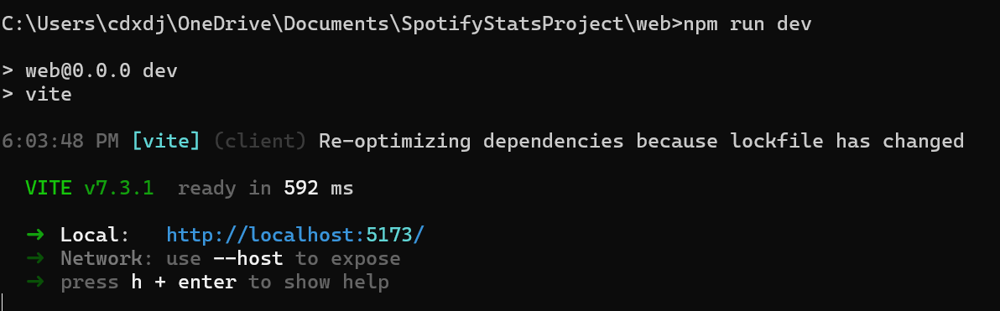
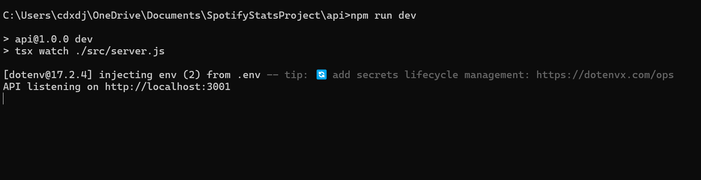

# Overview
Ideas for this project came about while searching for jobs after my departure from Microsoft in 2025. During my search, I noticed the demand for full-stack software engineers, particularly those accustomed to the use of AI (generative or not). I also noticed my last full stack project was nearly 4 years ago, and the relative lack of solo projects on my resume. I wanted to take this opportunity between jobs to work on a project that help hone my skills in full-stack engineering, while also exploring my interests in data analytics.

## Who I Am
My name is Carlos. 
- UCI Class of 2024 (BS in Computer Science)
- Microsoft Alumnus (Aug 2024 - Aug 2025)
- Former coding instructor (May 2022 - Jun 2024)
- Freelance AI Trainer with DataAnnotation (since Jan 2026)
- Currently searching for a new software engineering (or related) position to explore my interests in coding
On my free time, outside of coding, I love to draw, clean, and go down internet rabbit holes. The latter of these stems from my curiosity, which has definitely fueled my interest in this project.

## The Problem I Want to Solve
We may frequently say "this summer has been very hot", or "it hasn't rained much this year", but we don't always know for sure without data. We as humans are well-aware that we cayn "imagine" conclusions. The goal of this program is to make the differences in climate patterns in different regions more accessible to people more quickly, and to remove the guesswork behind if we are just imagining things about the weather.

# Software Goals
There are several goals in this project, either for the user or for myself.
## For Users
- To be able to retrieve weather data across the world in different periods from the past 40 years (as far back as OpenWeather API allows)
- For users to be able to easily see how current weather patterns differ from past years, to confirm if things are truly different or simply "in their head"
- Training AI to be able to detect the true anomalous nature of modern weather in different places
## Skills to train
- Full-stack development
- Healthy coding hygiene (CI/CD practices and extensive testing)
- API calls and parsing
- Data collection for AI training
- Popular industry tools like TypeScript & React

# Current Status
The project, as of early February 2026, is still in its initial stages. I have a basic front and back end going that gives real-time weather updates.
## Current Features
- Real-time weather data for cities across the world
- Ability to toggle units
- A separated back and front end that communicate to collect and present data using NodeJS, TS, and React
## Short-term objectives
- Adding unit tests
- Finish this README
- Refactoring code for easier testing
- Adding some sort CI/CD protections ensuring unit tests are passed before code can be merged
- Adding extensive error-based logic to account for any erroneous inputs so that the website will not crash from user error

# Usage Instructions
1. [Download NodeJS and locally set up react.](w3schools)
2. Obtain an OpenWeather API key.
3. Download the repo
4. Open a Command Prompt (cmd)
5. Ensure you can use the npm commands in BOTH the ./web and ./api directories
   ``npm -v``
6. Open a second command prompt. Navigate one cmd to the ./web folder and the other to ./api
7. On both cmds, run the following
  ``npm run dev``
  This should appear for the ./web cmd
   
  And this on the ./api
   
